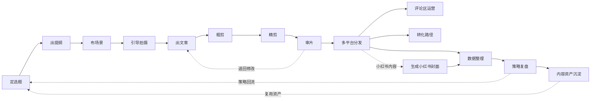

<div align="center">

# 🎬 Social Media Creator Workflow

### 从一个选题，到一套会持续变聪明的内容生产系统


一个以创作者真实工作流为骨架的多专家 Agent Skill 项目。
用户只需记住一个入口，也可以从任意创作工序直接开始。

</div>

---

## ✨ 它能做什么

这套 Skills 覆盖内容生产、发布、复盘和沉淀的完整闭环：



每个工序由一个独立专家负责。主路由只判断当前最适合进入哪一步，不会把所有方法
堆进一个巨型提示词，也不会强迫用户从头跑完整条链路。

## 🚀 快速开始

### 安装

```bash
SKILLS_HOME="$HOME/.agents/skills" node tools/install.mjs
```

安装器把整个仓库链接到 Skill 根目录，保证专家能继续读取共享知识；它不会覆盖真实
目录或无关符号链接。默认目标为 `${CODEX_HOME:-~/.codex}/skills`。

### 只记一个入口

直接说：

```text
使用 social-media-creator-workflow。
我已经有一条关于 AI 求职的选题，帮我出提纲，并给我 5 种不同机制的开头。
```

主路由会把任务交给 `outline-builder`。已有上下文会继续复用，无需重新填写整套
账号资料。

### 直接调用某个工序

```text
使用 social-media-creator-workflow-data-organizer。
这是过去 30 条小红书内容的后台 CSV，请统一字段、计算能计算的比率，
并标出缺失项和不可比数据。
```

## 🧩 1 个主路由 + 22 个专家

| 工序 | Skill | 主要交付 |
|---|---|---|
| 🧭 总控 | `social-media-creator-workflow` | 当前工序识别、动态路由、回退与回流 |
| 01 定选题 | `social-media-creator-workflow-topic-selector` | 选题候选、评分、内容使命、系列归属 |
| 02 出提纲 | `social-media-creator-workflow-outline-builder` | 多版本开头、标题方向、结构提纲 |
| 03 布场景 | `social-media-creator-workflow-scene-designer` | 场景表、镜头表、道具与转场 |
| 04 引导拍摄 | `social-media-creator-workflow-shooting-director` | 拍摄顺序、逐镜提示、补拍清单 |
| 05 出文章 | `social-media-creator-workflow-content-writer` | 口播稿、旁白、图文、文章或字幕稿 |
| 06 粗剪 | `social-media-creator-workflow-rough-cut-planner` | 素材取舍、粗剪时间线、补拍点 |
| 07 精剪 | `social-media-creator-workflow-fine-cut-planner` | 节奏、字幕、BGM、包装与导出标注 |
| 08 审片 | `social-media-creator-workflow-content-reviewer` | 审核结论、问题优先级、回退工序 |
| 09 多平台分发 | `social-media-creator-workflow-multiplatform-distributor` | 平台标题、封面、正文与关键词 |
| 10 小红书封面 | `social-media-creator-workflow-xhs-cover` | 封面生成、局部修改、参考图风格学习 |
| 11 数据整理 | `social-media-creator-workflow-data-organizer` | 标准化数据、派生指标、异常记录 |
| 12 策略复盘 | `social-media-creator-workflow-strategy-reviewer` | 诊断、置信度、实验与行动计划 |
| 13 资产沉淀 | `social-media-creator-workflow-asset-distiller` | 复用模板、证据、来源与使用边界 |
| 14 活人感小红书广告 | `social-media-creator-workflow-xhs-human-ad` | 标题、正文、事实核对项与标签 |
| 15 活人感招聘 | `social-media-creator-workflow-recruitment-human-ad` | 候选人视角招聘内容与投递动作 |
| 16 触达调研 | `social-media-creator-workflow-reach-research` | 带来源和日期的公开平台调研 |
| 17 开源宣发 | `social-media-creator-workflow-open-source-launch` | X、公众号、小红书成稿与事实表 |
| 18 账号定位 | `social-media-creator-workflow-positioning` | 定位候选、定位句、内容支柱与验证计划 |
| 19 小红书组图 | `social-media-creator-workflow-xhs-carousel` | 多页 HTML 或图片、页序和质量检查 |
| 20 账号体检 | `social-media-creator-workflow-account-audit` | 账号级瓶颈、证据边界与优先动作 |
| 21 社区运营 | `social-media-creator-workflow-community-manager` | 评论回复、置顶评论、边界与互动动作 |
| 22 转化路径 | `social-media-creator-workflow-conversion-path` | 内容、主页、评论、私信与行动承接 |

`SpaceZephyr/creator-buddy` 的十个小红书入口经过冲突审计后只新增这三个结果。热点、
标题、正文、封面和单篇数据能力分别进入现有选题/调研、分发、写作、封面和数据复盘
事实源；总控入口不重复创建。

`human-writing` 与《小红书运营手册 · AI工作台》也经过相同的冲突审计。通用写作方法
进入内容写作；主页、母题栏目、选题日历和标题进入现有专家；只新增社区运营与转化
路径两个此前没有稳定归属的结果。

## 🎨 小红书封面能力与作者

小红书封面专家改编自
[`Vivixiao980/xhs-cover-skill`](https://github.com/Vivixiao980/xhs-cover-skill)，并已接入
主路由。它覆盖新封面生成、基于上一版的局部修改、参考图风格提取，以及 18 种预设
视觉方向；在 Codex 中优先使用原生图片生成/编辑能力，不要求额外配置 API。

上游作者 **Vivi（[@Vivixiao980](https://github.com/Vivixiao980)）** 围绕小红书封面
创作整理了这套开源 Skill，将常见视觉风格、封面生成与修改流程、参考图风格学习和
命令行备用能力放进一个可复用工作流。本项目保留其仓库链接、作者署名、集成版本与
MIT 许可证说明；具体见 [`THIRD_PARTY_NOTICES.md`](THIRD_PARTY_NOTICES.md)。

## 🧠 内嵌的方法论

- 从目标用户的观看动机出发，再匹配创作者真实资源。
- 一条内容先确定主要使命：流量、涨粉、转化、调性或表达。
- 同一主题同时提供直接价值、好奇、反常识、矛盾等开头版本。
- 标题和开头承诺的价值必须在正文中兑现。
- VLOG 检查真实、反差、交互和叙事主线。
- 粗剪先解决故事与信息，精剪再处理字幕、音乐和包装。
- 单条数据不足以否定账号方向，策略结论必须带证据与置信度。
- 单次偶然高数据先记录为待验证假设，不直接固化成成功公式。

## 📊 CSV 数据整理

数据整理专家附带纯 Python 标准库脚本：

```bash
python3 \
  skills/social-media-creator-workflow-data-organizer/scripts/normalize_creator_csv.py \
  source.csv normalized.csv
```

脚本会：

- 映射常见中英文后台字段；
- 保留无法识别的原始字段；
- 仅在分母有效时计算派生比率；
- 拒绝多个原字段静默覆盖同一个标准字段。

## 🏗️ 项目结构

```text
social-media-creator-workflow/
├── skills/                 # 主路由与 22 个专家
├── knowledge/
│   ├── skill-packs/        # 每个专家专用方法
│   ├── atoms/              # 可追溯方法原子
│   ├── cases/              # 场景、决策与经验
│   ├── project-profile.md  # 创作者项目档案
│   └── workflow-contract.md
├── docs/architecture.md
├── tests/
└── tools/                  # 验证器与安全安装器
```

详细边界与数据流见 [`docs/architecture.md`](docs/architecture.md)。

## ✅ 验证

```bash
python3 tools/validate_project.py .
python3 -m unittest discover -s tests -v
python3 -m unittest discover \
  -s skills/social-media-creator-workflow-data-organizer/tests -v
```

本地有 `uv` 时，可进一步验证所有 Skill frontmatter：

```bash
for skill in skills/*; do
  uv run --with pyyaml python \
    /root/.codex/skills/.system/skill-creator/scripts/quick_validate.py "$skill"
done
```

## 🔐 来源与分发边界

本项目原创代码与文档使用 MIT。通用内容方法参考用户提供的两份材料；原始材料的
公开再分发授权尚未确认，因此：

- 不复制长段原文或独特品牌表达；
- 平台规则、流量比例和红利期等时效性观点不作为永久事实；
- 公开发布前需要重新确认材料权利和许可证。

小红书封面专家另行改编自公开项目
[`Vivixiao980/xhs-cover-skill`](https://github.com/Vivixiao980/xhs-cover-skill)，遵循
其上游 README 声明的 MIT 许可证和本仓库的第三方归属说明。

[`SpaceZephyr/creator-buddy/xhs-Skills`](https://github.com/SpaceZephyr/creator-buddy/tree/main/xhs-Skills)
在本次核验时没有仓库或子目录许可证，因此仅作为参考来源：本仓库不复制其原文、
脚本、模板、素材或样式库，只保留独立表达的通用工作流和冲突裁决。

[`KKKKhazix/human-writing`](https://github.com/KKKKhazix/human-writing) 与
[`nihe0909/xiaohongshu-ai-workbench`](https://github.com/nihe0909/xiaohongshu-ai-workbench)
均按 MIT 许可改编并保留版本归属；没有复制作者身份、推广材料或打包制品。

## 🗺️ 参与开发

开发采用“一条 Issue 对应一个可验收工序”的方式。每项完成后先运行最小测试，
再单独提交和关闭 Issue。新增专家时请同步更新：

1. `project.json`
2. 主路由 Expert map
3. `knowledge/skill-packs/`
4. `docs/architecture.md`
5. 对应 `evals/evals.json`

---

<div align="center">

**让每一次创作，都能给下一次留下可复用的东西。**

</div>
