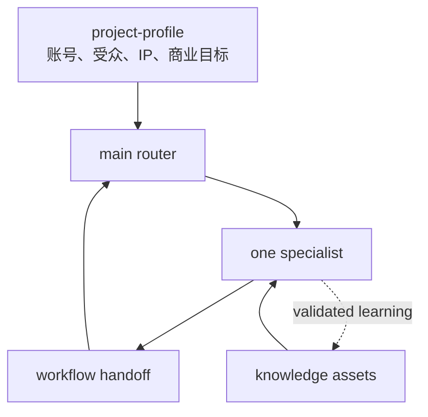

# Architecture

## 设计目标

`social-media-creator-workflow` 是唯一稳定主入口。用户也可以直接点名专家，但
不需要先学习完整目录。系统从当前对话判断工序，一次选择一个专家。

## 专家地图

- `social-media-creator-workflow-positioning`: Turn creator assets, audience, goals, and sustainable supply into an account positioning and initial content system.
- `social-media-creator-workflow-topic-selector`: Turn creator context, audience needs, platform signals, and content goals into prioritized topics.
- `social-media-creator-workflow-outline-builder`: Turn an accepted topic into a shootable and writable content outline with multiple opening options.
- `social-media-creator-workflow-scene-designer`: Translate an outline into scenes, shots, props, actions, and visual information.
- `social-media-creator-workflow-shooting-director`: Guide the creator through capturing complete, usable, and expressive footage.
- `social-media-creator-workflow-content-writer`: Turn topics, outlines, and footage notes into scripts, narration, posts, or publishable articles.
- `social-media-creator-workflow-rough-cut-planner`: Build the first coherent edit from raw footage while preserving the story and identifying missing material.
- `social-media-creator-workflow-fine-cut-planner`: Specify pacing, captions, music, visual packaging, and export requirements after the rough cut is stable.
- `social-media-creator-workflow-content-reviewer`: Review a finished or near-finished content piece and route revisions to the correct production stage.
- `social-media-creator-workflow-multiplatform-distributor`: Adapt one content asset into platform-specific publishing packages without flattening platform differences.
- `social-media-creator-workflow-xhs-cover`: Generate, edit, or learn a Xiaohongshu cover style with Codex image generation and 18 presets adapted from Vivi's xhs-cover-skill.
- `social-media-creator-workflow-xhs-carousel`: Turn approved content into a consistent multi-page Xiaohongshu carousel using exact-text HTML or generated imagery.
- `social-media-creator-workflow-account-audit`: Diagnose an existing social account or compare it with peers using user-provided profile evidence and auditable data.
- `social-media-creator-workflow-data-organizer`: Normalize creator-provided screenshots or CSV exports into a comparable, auditable content dataset.
- `social-media-creator-workflow-strategy-reviewer`: Turn normalized performance data into evidence-based content strategy and testable next actions.
- `social-media-creator-workflow-asset-distiller`: Convert completed work and validated lessons into reusable creator assets with provenance and usage limits.
- `social-media-creator-workflow-xhs-human-ad`: Write evidence-grounded Xiaohongshu advertising copy with natural human rhythm.
- `social-media-creator-workflow-recruitment-human-ad`: Write candidate-first recruitment content.
- `social-media-creator-workflow-reach-research`: Research dated public platform signals and reach paths.
- `social-media-creator-workflow-open-source-launch`: Produce a verified cross-platform open-source launch package.

## 责任边界

主路由只做上下文复用、工序判断、相邻工序裁决和下一步导航。完整方法放在专家
Skill 与对应的 `knowledge/skill-packs/`，避免路由器逐渐膨胀。

专家拥有一个清楚结果。相邻工序使用稳定裁决：

- 长期账号价值与内容支柱 → 账号定位；下一条具体讲什么 → 定选题；
- 选题未确定 → 定选题；选题已定、需要结构 → 出提纲；
- 需要内容逻辑 → 出提纲；需要镜头和地点 → 布场景；
- 需要拍摄方案 → 布场景；准备开拍或补拍 → 引导拍摄；
- 需要文字 → 出文章；需要素材取舍 → 粗剪；
- 主线未稳定 → 粗剪；需要字幕音乐包装 → 精剪；
- 需要能否发布判断 → 审片；需要实际修改 → 回退对应工序；
- 需要标题、正文、标签等发布包装 → 多平台分发；需要实际生成或修改小红书封面
  图片 → 小红书封面；
- 单张首图 → 小红书封面；多页知识卡片、组图或可截图 HTML → 小红书组图；
- 主页和多篇内容形成的账号级瓶颈 → 账号体检；单篇/批量数据漏斗 → 数据整理与策略复盘；
- 需要清洗数字 → 数据整理；需要运营判断 → 策略复盘；
- 需要下一步行动 → 策略复盘；需要长期复用 → 资产沉淀。
- 普通正文 → 内容写作；商业小红书广告 → 活人感小红书广告；
- 招聘传播 → 活人感招聘；候选人搜索和数据库操作 → 外部招聘工具；
- 需要公开证据 → 触达调研；已有验证事实的开源发布 → 开源项目宣发。

## creator-buddy xhs-Skills 冲突裁决

| 上游入口 | 本项目落点 | 裁决 |
|---|---|---|
| `space-xhs-buddy` | 主路由 | 纯重复，不新增总控 |
| `space-xhs-positioning` | `positioning` | 独立账号级结果，新增专家 |
| `space-xhs-hotspot` | `topic-selector` + `reach-research` | 研究与选题分层，不新增热点入口 |
| `space-xhs-title` | `multiplatform-distributor` | 标题属于发布包装，不抢正文路由 |
| `space-xhs-writer` | `content-writer` + `xhs-human-ad` | 普通内容与商业内容继续隔离 |
| `space-xhs-cover` | `xhs-cover` | 现有入口已覆盖，补测试纪律 |
| `xhs-html` + `space-xhs-image` | `xhs-carousel` | 合并为精确文字与生成图两种模式 |
| `space-xhs-account-audit` | `account-audit` | 独立账号级诊断，新增专家 |
| `space-xhs-note-analytics` | `data-organizer` + `strategy-reviewer` | 事实整理与策略归因保持分离 |

上游仓库与子目录未声明许可证。本项目只记录 commit
`3185fe21f523feeb6599814629f581cb6d5f05b3` 的参考关系，不复制其文字、代码、
模板、素材、样式注册表或第三方数据接入。

## 数据流



专家按 `knowledge/workflow-contract.md` 交接：

- 当前工序；
- 实际使用的输入；
- 必要假设；
- 完整交付；
- 质量检查；
- 尚存缺口；
- 建议下一工序。

## 回退与反馈闭环

- 审片可以回退到出文章、引导拍摄、粗剪或精剪；
- 策略复盘优先把结论回流到定选题，也可影响提纲和分发；
- 资产沉淀更新选题母题、开头、用户洞察、IP故事、场景、写作和剪辑模式；
- 路由器每次根据最新上下文重新判断，不硬编码一条必须跑完的长链。

## 共享知识

Shared knowledge lives outside the skills so specialists can evolve without
duplicating sources. `knowledge/sources.jsonl` is the provenance system of
record. Atoms and cases cite source IDs.

小红书封面专家的 Codex 原生工作流和 18 种预设风格改编自
[`Vivixiao980/xhs-cover-skill`](https://github.com/Vivixiao980/xhs-cover-skill)。
本仓库保留作者 Vivi（[@Vivixiao980](https://github.com/Vivixiao980)）、上游版本与
MIT 归属；Node.js / Gemini CLI 备用路径不在本仓库重复维护。

Routing is dynamic. A specialist result may suggest a possible next expert,
but the router re-evaluates from the latest context instead of enforcing a
fixed chain.

## 安装形态

项目必须保持完整目录安装。专家通过 `../../knowledge/` 读取共享方法，因此不要
只把单个专家目录复制到独立位置。推荐将整个仓库克隆到：

```text
~/.codex/skills/social-media-creator-workflow/
```

Codex 会递归发现 `skills/*/SKILL.md`，共享知识的相对路径保持有效。

## 来源与许可证

仓库原创内容使用 MIT。两份用户材料的公开再分发权未确认，因此只保留来源登记和
抽象规则，不分发原文或独特表达；改编的小红书封面部分继续遵循
`THIRD_PARTY_NOTICES.md` 中的 MIT 归属。平台时效性观点必须带来源日期与不确定性。
`SpaceZephyr/creator-buddy/xhs-Skills` 同样按无许可参考来源处理，不进入 MIT 再分发物。
